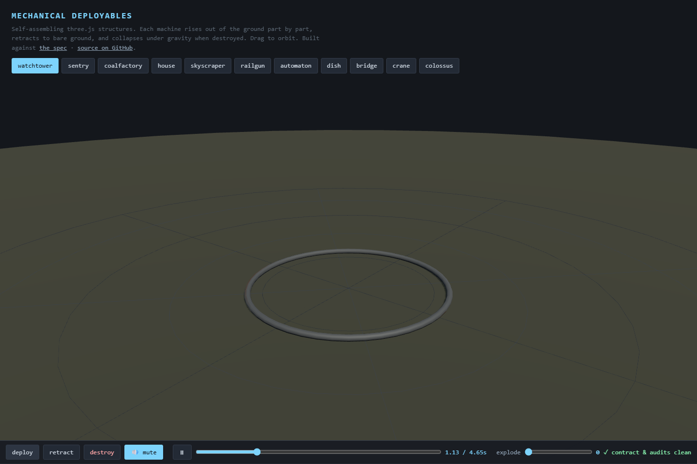
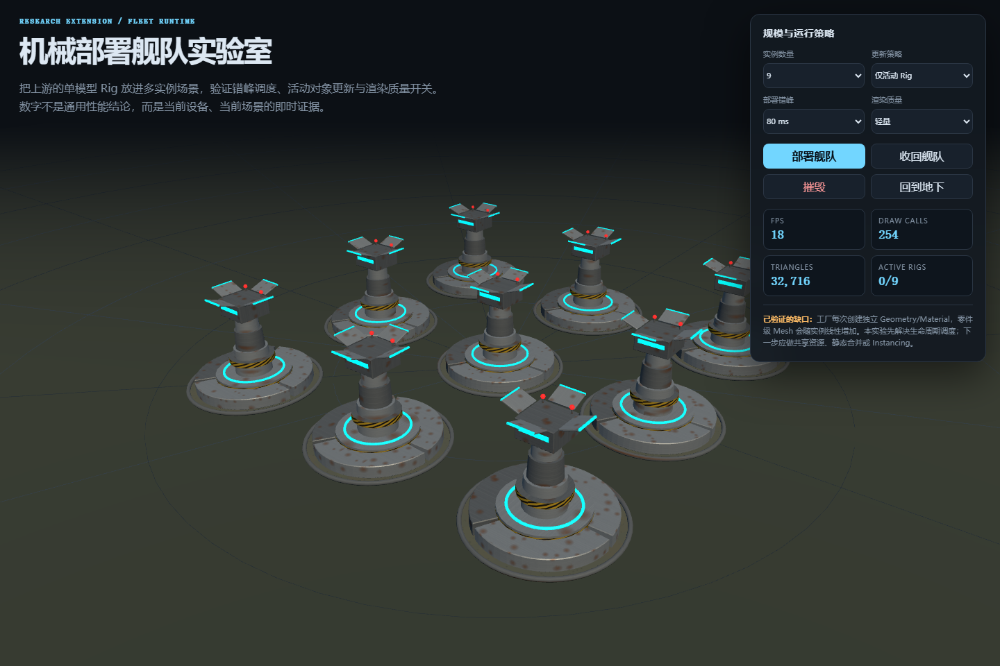
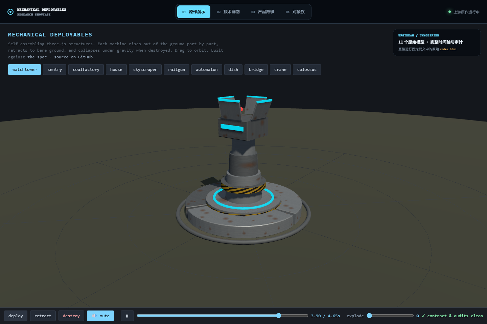
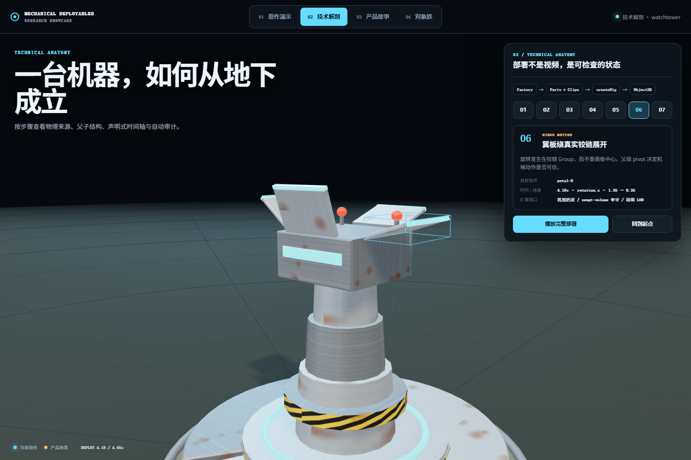
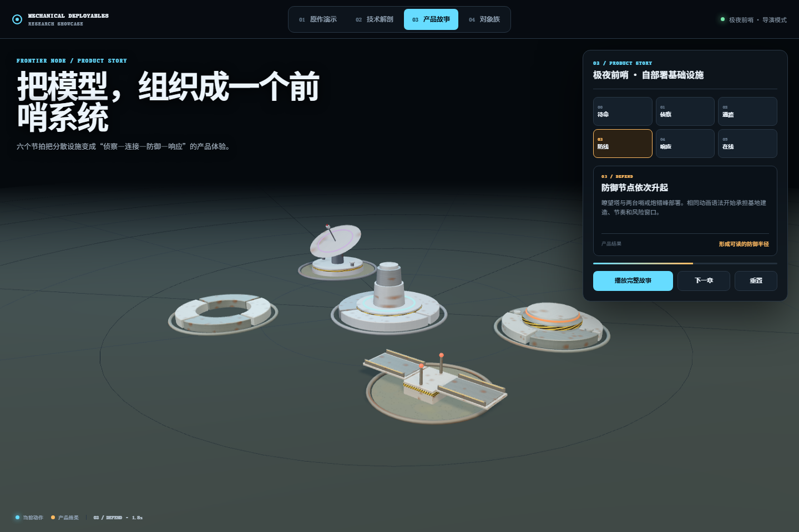
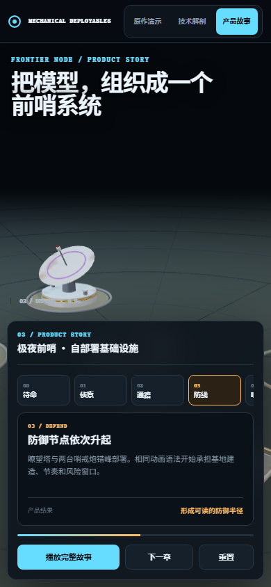

# 运行基线（2026-08-22）

## 环境与方法

- 上游提交：`f9d757d36c64ef45aaf9aca94f81bc73e59bf0d5`
- Three.js：上游 import map 固定 `0.180.0`
- 浏览器：Playwright Chromium，1440×960，无头模式
- 页面：本地静态 HTTP server
- 验收：页面 200、画布非空、按钮存在、部署时间推进、console/page error 为空
- 模型统计：运行后遍历 `rig.root`，读取 parts、clips、geometry index/position attributes、material UUID 和上游 audit 结果

无头 Chromium 在本环境使用软件渲染，因此 FPS 只用于发现严重退化，不用于推断玩家设备性能。

## 上游功能基线

- 11 个模型全部加载；
- deploy / retract / destroy / mute 可见；
- watchtower 部署时间从 0 推进；
- 11 个模型 contract + 四类 audit 均为 0 issue；
- 控制台错误 0，page error 0。

## 模型规模

| 模型 | Parts | Meshes | Triangles | Deploy sequences | Deploy duration |
| --- | ---: | ---: | ---: | ---: | ---: |
| watchtower | 15 | 26 | 3,628 | 21 | 4.65s |
| sentry | 14 | 24 | 4,092 | 21 | 4.25s |
| coalfactory | 13 | 22 | 1,704 | 16 | 4.42s |
| house | 10 | 18 | 1,520 | 13 | 4.22s |
| skyscraper | 10 | 20 | 1,592 | 13 | 4.47s |
| railgun | 12 | 19 | 2,648 | 16 | 4.42s |
| automaton | 11 | 26 | 1,708 | 20 | 4.47s |
| dish | 11 | 17 | 2,168 | 15 | 4.42s |
| bridge | 11 | 20 | 1,664 | 15 | 4.42s |
| crane | 12 | 23 | 1,628 | 15 | 4.47s |
| colossus | 14 | 44 | 2,424 | 23 | 4.97s |
| **合计** | **133** | **259** | **24,776** | **188** | — |

全部 clips 合计 34 个、sequences 合计 609 条。每个 Mesh 在单个 factory 实例中都有独立 geometry；每个 factory 创建六个语义材质对象。

## Fleet lab 基线

默认轻量档关闭动态阴影，像素比上限 1.25：

| Watchtower 数量 | Draw calls | Triangles | 说明 |
| ---: | ---: | ---: | --- |
| 9 | 254 | 32,716 | 静止部署态 |
| 25 | 702 | 90,764 | 静止部署态 |

错峰设为 80ms 后，在一次中间采样中出现 8 active / 1 pending，证明调度器没有提前更新等待实例。调度器单元测试共 8 项断言通过。

## 有边界的结论

- 当前模型三角形规模轻，25 个完整 watchtower 仍少于 10 万三角形；
- draw calls 随零件数和实例数线性增长，是比 triangle count 更早出现的风险；
- active-only 更新可以减少空闲 CPU 工作，但屏幕内静止 Mesh 仍会被绘制；
- 下一轮应比较“原始分件 / 共享资源 / 静止合并 / 动画 LOD”，并在真实 GPU 上记录帧时间和内存。

## 三段式 showcase 验收

- 原作：iframe 内 11 个模型存在，deploy 后时间轴推进；
- 技术：七个步骤可选择，真实 `rig.setTime()` 推进姿态，第六步显示铰链目标包围框；
- 故事：六章均可直接到达，自动播放可从待命推进到侦察，reset 回到确定性起点；
- 键盘：从原作导航按 Tab 到技术解剖，Enter 可切换；
- 移动：390×844 下场景保持可见，控制面板变为底部面板且无水平溢出；
- reduced motion：媒体偏好可识别，章节切换不依赖动画才能显示信息；
- fallback：`?fallback=1` 隐藏 WebGL 舞台并显示四段完整可读说明；
- 原作、fleet lab 与 showcase 全部路径无 console/page error。

最终证据：

